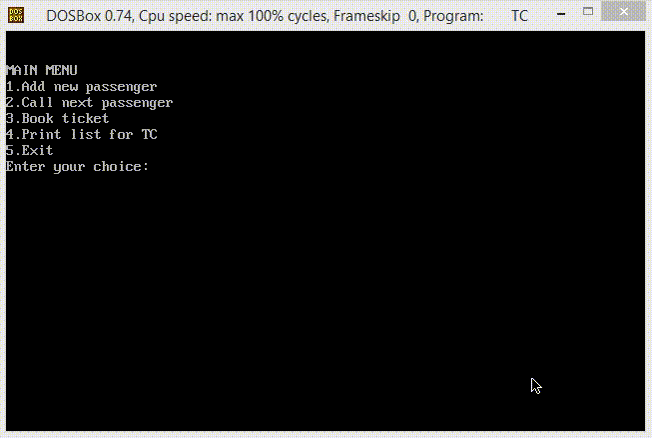

  

<h1 align="center">Data Structures Project</h1>

<h4>This project was developed as part of Data Structures coursework and tries to demonstrate the applications of many data structures like 1-D array, 2-D array, linked list, queue, graph as well as some data handling techniques like hashing.</h4>

-----------------------------------------
### Problem Statement

You need to design a system for railway ticket booking centers. Whenever a person enters the booking center, he registers his name so that the proper order of who came first is maintained and people can sit comfortably instead of standing in queues and the order is also maintained. When a person books a ticket, he should be assigned a seat from among the remaining seats by following a specified pattern. Once booked, the passenger should be able to see what all stations he can travel to i.e. what is the validity of the ticket. He should also be able to see the list of stations before the last station his ticket is valid at, in the proper order. Lastly, a list to be prepared to be given to the ticket inspector, but that should be seat wise, and not according to the order in which seats were booked.

------------------------------------------
### Features
 
- `Entry of a new person` : When someone enters the booking center, the name of that person is added to the queue.
- `Call next person in queue` : When someone books a ticket and leaves, the next person in the queue is called to book a ticket.
- `Book ticket` : Book ticket by selecting the source and destination station, number of people travelling, and whether a single journey or return ticket is required. A 'station list' is displayed for the traveller's reference.
- `Display of reservation chart for TC` : A list of alloted seats is displayed for the ticket checker.

------------------------------------------
### Demo

    

------------------------------------------
### Running the program
Your system needs to have [DOSBox](https://www.dosbox.com/) installed and configured. Refer [this](http://comptech-blogger.blogspot.com/2012/12/how-to-run-turbo-c-in-windows-7-using.html) to install DOSBox. Open the program in DOSBox and click on 'Run'.

------------------------------------------
### Author
Mihir Gandhi - [mihir-m-gandhi](https://github.com/mihir-m-gandhi)

------------------------------------------
### License
This project is licensed under the MIT - see the [LICENSE](./LICENSE) file for details.
